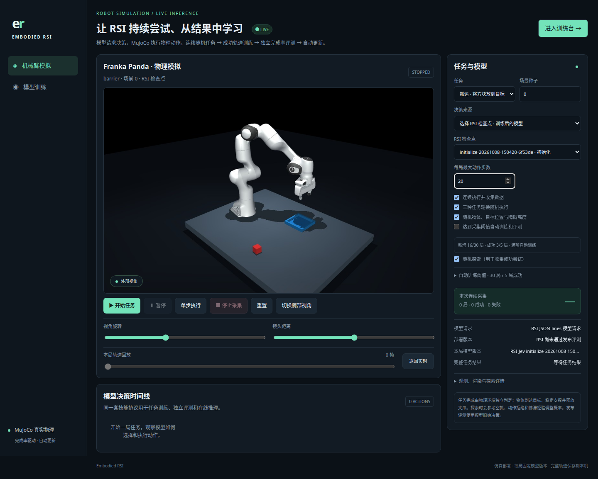

# Embodied RSI

把 [EmbodiedJev](https://github.com/FBddcz/embodied-jev) 的 MuJoCo 机械臂仿真与 [RSI-Jev](https://github.com/Shanghua-Gao/RSI-Jev) 的可训练决策模型连接起来。

**连续随机任务 → 收集模型成功轨迹 → 达到数据阈值后训练 → 独立完成率评测 → 达标自动部署 → 下一局使用新模型。**




## 已实现

- `/simulation`：实际 MuJoCo / Franka Panda 画面；模型请求选择技能，物理环境执行和判定成功。1024×640、4× MSAA、阴影、腕部摄像头、暂停、单步、停止和本局回放。
- 连续执行：成功、失败或用尽动作预算后重新初始化；每局默认 20 步，可调整。三种任务打乱轮换，随机化源方块、目标区位置和障碍高度。种子、场景参数、哈希、模型版本与完整动作均保存。
- 失败引导探索：空抓、拒绝、失抓和停滞经验调整后续采样，保留原模型概率与探索概率。独立发布评测使用模型原始决策。
- 自动训练：默认新增 **30 局完整轨迹且至少 5 局成功** 后，启动 100 次更新。训练期间继续采集；后台忙时等待；已消费的数据不重复触发。前端可调整阈值和预算。
- RSI 成功轨迹回放：只使用模型实际完成的轨迹及实际执行动作，过滤其中被拒、空抓和失抓等失败动作。教师示范初始化单独标记；没有成功数据时跳过训练。
- **按完整任务完成率选择检查点**，loss 用于训练诊断。开发完成率退化时保留之前更好的版本。
- 至少 90 对新随机场景，比较候选与父模型；完成率、统计区间、每项任务与风险门槛全部通过才自动部署。模型校验、加载和推理预热后原子切换；一局执行期间固定版本。
- `/training`：完成率与 loss 并排、检查点摘要、真实样本和失败轨迹、发布门槛、资源和异常事件；历史实验与低频诊断折叠。
- 可选 Compact CPU 参考模型及整局 REINFORCE。RSI GPU 推理通过隔离进程 JSON-lines 请求。服务重启可恢复之前仍获授权的连续采集；点击停止后不会恢复。

真实 RSI 小规模实验：模型探索 9 局完成 3 局，32 个实际动作样本训练后，90 个独立场景上的完成率从 **37.8% 到 44.4%**。但提升的区间包含下降，越障任务略退化、失抓增多，候选**没有发布**。CPU 参考模型的 100% 成绩单独报告。见 [验证记录](docs/VALIDATION.md)。

当前模型使用结构化仿真状态选择九种技能，程序负责航点和 IK。图像由物理引擎渲染；没有使用图像生成模型模拟机械臂，也尚未实现从相机像素直接控制或真机部署。

## 安装与启动

Python 3.11+、Git、uv；前端不需要 Node.js 或外部 CDN。

```bash
git clone https://github.com/gaohuan2020/embodied-rsi.git
cd embodied-rsi
python3 scripts/bootstrap.py --rsi
.venv/bin/embodied-rsi dashboard --port 8091 --rsi-python "$PWD/.venv-rsi/bin/python"
```

机械臂模拟：http://127.0.0.1:8091/simulation

训练报表：http://127.0.0.1:8091/training

RSI 自我提升默认为固定 revision 的文本单出口 `v1.0-0.8b`。首次启动会下载权重，需要相应 GPU 与存储。已验证 Linux / aarch64 / NVIDIA GB10；上游 commit 固定在 `upstreams.lock.json`。只有 CPU 时省略 `--rsi` 和 `--rsi-python`，选择 Compact 参考策略验证流程。

Linux 无窗口渲染默认 EGL；CPU 可安装 Mesa / EGL，必要时设置 `LIBGL_ALWAYS_SOFTWARE=1`。CI 使用 OSMesa。依赖固定在 `constraints-simulation.txt`。

在模拟页选择 RSI 自动更新，启用连续采集、探索和自动训练，设置阈值后开始。可选已有 RSI 检查点作为起点；通过发布后下一局自动读取新的 RSI 版本。弱模型可能长时间无法成功，可在训练页显式进行示范初始化，或继续探索；不会制造成功样本。

## 命令行训练

```bash
# 探索、成功轨迹训练、独立随机评测与条件部署
.venv-rsi/bin/embodied-rsi self-improve --rounds 2 --explore-episodes 30 --episodes 30 --steps 100

# 已经有持续采集数据，直接回放训练
.venv-rsi/bin/embodied-rsi self-improve --replay-only --rounds 1 --episodes 30 --steps 100 \
  --checkpoint artifacts/runs/RSI_TRAIN_ID/checkpoint

# 可选的示范初始化，与模型自采成功数据分开标记
.venv-rsi/bin/embodied-rsi initialize-rsi --dataset artifacts/datasets/TEACHER_DATASET \
  --checkpoint v1.0-0.8b --steps 10

# 可选的整局奖励 REINFORCE 参考链路
.venv/bin/embodied-rsi cycle --backend compact --rounds 1 --episodes 30 --steps 6
```

RSI 成功回放冻结文本塔，缓存特征并更新决策头；保存上游兼容检查点。开发和发布都执行完整任务。自动流程用 SQLite 持久分配独立训练／开发／发布种子，发布场景不参与训练。采集随机分布版本为 `workspace-random-v1`，实际可达性和碰撞检查仍由上游执行。

## 自动发布门槛

| 指标 | 门槛 |
|---|---|
| 新场景配对 | 至少 90 对，三项任务各至少 30 对 |
| 完整任务完成率提升 | 至少 5 个百分点 |
| 配对 bootstrap 95% 区间 | 提升下界大于 0 |
| 每项任务退化 | 不超过 2 个百分点 |
| 碰撞、失抓、动作拒绝 | 各项总数不增加 |
| 模型检查 | 评测哈希一致、真实加载和推理预热通过 |

RSI 与 Compact 分别保留注册表，避免用 CPU 成绩代替 RSI 表现。通过门槛才切换部署版本，失败或过期评测不会覆盖当前模型。每轮训练不保证进步。

`POST /v1/systemone` 返回当前活动部署模型的动作概率和实际 `model_version`。模型概率是动作偏好，不能当成整局成功概率。

数据、权重、SQLite 和作业日志位于被忽略的 `artifacts/`。公开仓库包含代码、截图和脱敏报告。后台训练互斥，页面关闭不影响训练；本地工作台限制 Host 和跨 Origin 写请求，远程可使用 SSH 转发。当前部署目标为本地仿真服务。

## 开发

```bash
.venv/bin/ruff check src tests scripts
MUJOCO_GL=egl .venv/bin/pytest -q
```

[架构与 API](docs/ARCHITECTURE.md) · [验证记录](docs/VALIDATION.md) · [实施路线](docs/ROADMAP.md)

本仓库代码使用 MIT。上游代码、模型、机器人资产与数据分别遵循其许可证；权重未包含在仓库。
