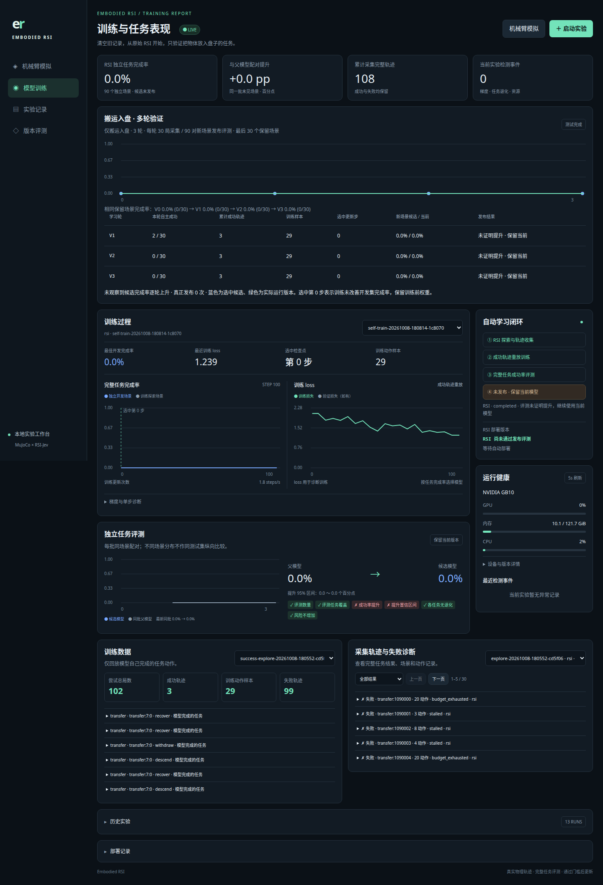

# Embodied RSI

连接 [EmbodiedJev](https://github.com/FBddcz/embodied-jev) 的 MuJoCo 机械臂仿真与 [RSI-Jev](https://github.com/Shanghua-Gao/RSI-Jev) 的决策模型。

当前实验只做一项任务：**把物体放进盘子**。旧轨迹、数据集、指标、微调检查点、部署版本和旧结果报告已清空。原始 RSI 预训练权重作为新实验起点。

**自主尝试 → 物理判定成功 → 收集成功动作 → 训练 → 新场景配对评测 → 达标更新 → 最终同场景审计。**

## 本轮测试

冷启动实测：原始 RSI 在 12 次随机探索中成功 1 次，另 11 次失败。探索完成率为 8.3%，这不是确定性独立评测成绩。没有使用教师示范初始化。

| 阶段 | 本次预算 |
|---|---|
| 任务与控制 | 搬运入盘，最多 20 个技能动作 |
| 初态 | 源物体位置在中心附近 ±2.5cm 随机；目标盘位置固定 |
| 学习轮数 | 3 轮 |
| 每轮自主采集 | 30 局；可继续利用前面实际成功轨迹 |
| 每轮训练 | 100 次 RSI 决策头更新，冻结文本塔 |
| 开发选模 | 10 个独立完整任务，按完成率选择检查点 |
| 每轮发布评测 | 90 对新场景，候选与当前版本使用同初态 |
| 最终统一审计 | 本次快速验证为 30 个保留场景；正式默认 90 个 |

所有轮次结束后才揭示最终审计集。分别画候选曲线与实际发布版本曲线；下降、持平和未发布都保留。**不保证、不强制成功率逐轮上升。** 单次通过发布门槛也不能证明整个学习曲线严格上升。

完整协议、种子边界和判定见 [测试计划](docs/TEST_PLAN.md)。实际结果见 [验证记录](docs/VALIDATION.md)。

**本次实测未观察到逐轮提升，未部署新模型。**

| 学习轮 | 本轮采集成功 | 训练 loss（首 → 末） | 独立发布评测 | 同场景最终审计 |
|---|---|---|---|---|
| 原始 V0 | 冷启动 1/12 | — | 各轮对照均 0/90 | 0/30 |
| V1 | 2/30 | 2.108 → 1.301 | 0/90 | 0/30 |
| V2 | 0/30 | 1.939 → 1.345 | 0/90 | 0/30 |
| V3 | 0/30 | 2.065 → 1.239 | 0/90 | 0/30 |

累计只有 3 条成功轨迹、29 个过滤后的动作样本。三轮开发完成率均未改善，选中的都是第 0 步权重；loss 下降没有转化为任务成功率提升。完整数值与模型哈希见 [实验结果](docs/results/transfer-study.json)。



## 安装与使用

Python 3.11+、Git、uv；前端不需要 Node.js 或外部 CDN。

```bash
git clone https://github.com/gaohuan2020/embodied-rsi.git
cd embodied-rsi
python3 scripts/bootstrap.py --rsi
.venv/bin/embodied-rsi dashboard --port 8091 --rsi-python "$PWD/.venv-rsi/bin/python"
```

[机械臂模拟](http://127.0.0.1:8091/simulation) · [训练与测试报表](http://127.0.0.1:8091/training)

训练页可启动「搬运入盘验证」。命令行等价运行：

```bash
.venv-rsi/bin/embodied-rsi transfer-study --rounds 3 --explore-episodes 30 \
  --steps 100 --episodes 90 --audit-episodes 30 --max-steps 20
```

需要新 `artifacts/` 或用全新目录 `--artifacts artifacts-transfer-new`；已有部署时研究命令拒绝复用旧基线。默认正式审计预算为 90。

继续单任务自动学习：

```bash
.venv-rsi/bin/embodied-rsi self-improve --tasks transfer --rounds 3 \
  --explore-episodes 60 --episodes 90 --steps 100
```

模拟页默认仅搬运入盘，支持连续执行、暂停、单步、停止、相机和回放；达到新增 30 局且至少 5 局成功后可自动训练。目标位置随机化暂不进入本轮实验，后续单独测试泛化分布。

## 训练与发布

模型请求选择九种技能，程序负责航点／IK，MuJoCo 执行物理并独立判定位置、稳定支撑、释放与撤离。模型输入为当前结构化状态；画面来自 MuJoCo 渲染。

失败记录用于调整探索，发布评测使用原模型确定性决策。只回放模型实际成功轨迹中的执行动作；过滤被拒、空抓、失抓和未持物搬运动作。loss 用于训练诊断，完整任务完成率决定保存哪一步。冻结塔缓存严格保留候选顺序；训练与线上统一 FP32，并验证预测一致。

| 发布门槛 | 要求 |
|---|---|
| 独立配对 | 当前仅 transfer，至少 90 对 |
| 完成率提升 | ≥5 个百分点 |
| 95% 配对 bootstrap 区间 | 提升下界 >0 |
| 任务与风险 | 无超限任务退化，碰撞／失抓／拒绝不增加 |
| 模型 | 评测哈希一致、实际加载与推理预热通过 |

通过才自动部署，下一局读取新模型，运行中的一局固定版本。报告与注册表写明验证过的任务范围；单任务成绩不能宣称覆盖堆叠或越障。

数据、模型、作业和 SQLite 存储在忽略的 `artifacts/`。冻结协议为 `runs/study-*/protocol.json`，每轮配对结果为 `runs/evaluate-*/report.json`，最终结果为 `study-latest.json`。本地界面限制 Host 与跨 Origin 写请求，远程可用 SSH 转发。当前部署目标为仿真服务。

## 开发

```bash
.venv/bin/ruff check src tests scripts
MUJOCO_GL=egl .venv/bin/pytest -q
```

[架构与 API](docs/ARCHITECTURE.md) · [实施路线](docs/ROADMAP.md)

本仓库使用 MIT；上游代码、权重、资产分别遵循其许可证，权重不包含在仓库。
