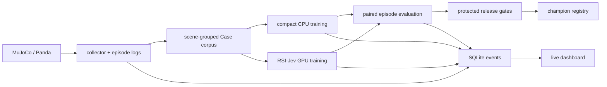

# 架构与数据边界

## 模块

| 文件 | 职责 |
|---|---|
| `sim.py` | 九种技能候选、状态白名单、物理执行、规则纠正与训练用分支标签 |
| `policies.py` | RSI 进程内与 `/v1/systemone` HTTP 适配 |
| `dataset.py` | 上游 `Case` 格式、70/15/15 场景组划分、去重、校验和 |
| `compact.py` | 基于数值观测与技能交互特征的 CPU softmax 参考模型 |
| `training.py` | 训练生命周期、开发集选择和温度校准 |
| `rsi_training.py` | 上游编码与损失、真实梯度更新、检查点保存和重载验证 |
| `workflow.py` | 批量采集、旧数据回放、两轮纠正闭环、配对评测 |
| `evaluation.py` | 配对区间、任务/风险门槛、哈希绑定的模型晋级 |
| `storage.py` / `monitor.py` | SQLite WAL、事件与资源采样、异常检测 |
| `dashboard.py` / `web/` | 本地 API、后台进程管理、无 CDN 监控界面 |

## 观测与标签

当前观测是显式标记的 privileged 模式：仿真物体／目标坐标、本体状态、当前接触事实。模型输入不含仿真成功真值、场景种子、未来分支结果或教师推荐动作。教师标签和动作结果在决策完成后用于学习。

技能航点由程序计算，模型学习的是选择技能和恢复方式。训练与评测使用同一九技能菜单，未用 `eligible_phases()` 为模型过滤阶段。越界目标可以过滤；执行前预演只校验已经选择的动作，不用候选未来收益替模型排序。

当前安全校验复用上游的部分碰撞监测。相同校验同时用于规则和模型策略；被拒动作不会自动替换成规则动作。报告同时记录拒绝、物理碰撞、失抓与停滞。

训练语料使用上游 `Case` JSONL 格式，附加 `provenance` 字段；上游加载器忽略该附加字段。分组为 `task:seed:intervention`，同组跨轮回放保持同一 split。跨 split 的相同状态与候选会导致构建失败。开发集用于选择和校准，测试标签不参与训练；任务级评测使用新场景或 manifest 中的 test 场景。

## 本地 API

- `GET /api/overview`：实验、数据集、资源、晋级模型和 dashboard 作业。
- `GET /api/runs/{id}/events?after={seq}`：增量事件，单次最多 5,000 条。
- `POST /api/jobs`：限定动作 `cycle / collect / train / evaluate`，限定参数范围和本地 artifact 目录。
- `POST /api/jobs/{id}/stop`：停止该 dashboard 自己启动的进程组。

页面每 2 秒拉取持久化事件；资源每 5 秒采样。dashboard 默认 localhost，拒绝其他 Host 与跨 Origin 的写请求。它是单用户本地工具，尚未实现账号权限管理。dashboard 后台作业在其进程内串行启动；独立 CLI 进程由使用者管理，GPU 重负载作业不应并发启动。

模型训练／采集不依赖 dashboard 在线。重启 dashboard 能读到过去的训练事件；进程控制句柄只属于启动它的 dashboard 实例，重启后需要在原终端管理仍运行的作业。

## 实验不可变性

上游 commit 固定在 `upstreams.lock.json`。数据集已有目录不可覆盖；每次训练重新核对 train/dev/test 哈希。每次训练输出独立目录。评测结果绑定整个候选 checkpoint 的 SHA256，晋级时重新验证。

晋级门槛作为仓库代码和冻结协议维护，训练器不会自行改写。后续自动研究器允许修改数据采样与训练配置；候选空间、观测协议、成功判定及门槛变更必须作为独立协议版本。
