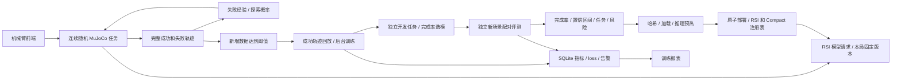

# 架构与接口

## 模块

| 模块 | 职责 |
|---|---|
| `sim.py` | 九技能协议、当前观测白名单、真实物理执行、完整任务回报 |
| `scenes.py` | 位置与障碍高度随机化、可复现种子、均衡随机任务轮换 |
| `simulation.py` | 连续执行、步数重置、渲染专用线程、暂停／停止／回放、授权意图恢复 |
| `exploration.py` | 当前状态分桶、失败经验持久化、探索概率调整、原始概率保留 |
| `auto_training.py` | 新增完整轨迹和成功数双阈值、等待忙任务、触发水位与恢复 |
| `self_improvement.py` | 成功模型轨迹筛选、特征缓存重放、开发选模、独立发布闭环 |
| `task_rsi.py` | 上游 RSI 冻结塔、可微决策头、缓存回放和整局策略梯度 |
| `task_training.py` | 可选 Compact / RSI 整局 REINFORCE |
| `workflow.py` / `evaluation.py` | 独立种子分配、配对报告、发布门槛、评测哈希绑定 |
| `deployment.py` / `inference_worker.py` | 注册表、实际加载与预热、版本引用、隔离 RSI JSON-lines 请求 |
| `dashboard.py` / `web/` | 模拟与训练报表、受限后台作业、原始样本浏览、推理 API |
| `storage.py` / `monitor.py` | SQLite WAL、指标与资源事件、异常检测 |

## 数据与训练目标

MuJoCo 根据物体位置、稳定支撑、释放与撤离判定整局成功。模型输入仅包含当前物体／目标／末端坐标、本体与接触状态、近期动作结果，不包含成功真值、种子、教师动作或未来收益。当前是 privileged-state 技能选择，程序提供航点、IK 和碰撞预演。

默认自我提升只训练完整成功模型轨迹中的实际执行动作。失败轨迹保留；成功轨迹内被拒、空抓、失抓和未夹持搬运动作也不作为模仿目标。训练 loss 是回放交叉熵，**开发完整任务完成率才决定保存哪一步**。教师初始化通过单独 `initialize` 实验记录，不计作模型自采成功。

失败探索使用状态桶的动作经验，结合模型原始概率、温度、新动作奖励、失败惩罚与 5% 均匀探索。该策略不会直接修改模型权重。正式评测不附加探索记忆，比较模型确定性决策。

当前默认仅 transfer，每新增 30 局且其中至少 5 局成功后训练；必须同时满足两个阈值。后台忙时继续收集并等待，接受训练后推进消费水位，避免同一小批成功反复触发。连续采集保存当前模型版本，每局终点后检查部署变化；停止只终止采集，训练页可单独停止后台训练。训练 CLI 使用持久文件锁，服务重启后也不会同时更新两个模型。

## 场景隔离和泛化

`workspace-random-v1`：源 X/Y 以 (0.43, -0.17) 米为中心分别 ±3.5/3 厘米；目标以 (0.43, 0.18) 为中心分别 ±2.5/2 厘米；越障高度 8–12 厘米。每个种子可复现。三种任务在每个连续三局区块中打乱顺序，均衡覆盖。上游参数验证、关键位姿可达性和实际碰撞检查仍运行。

此随机目标分布保留为后续泛化扩展。当前 transfer-study 采用原始 ±2.5cm 源位置扰动、固定目标，采集、开发和发布使用互不重叠的种子。每轮事务预留 30,000 个种子，训练／开发／发布各 10,000；取消的区间不再重复分配。发布也检查实际成功数据 manifest 的场景组，不把历史回放场景当作未见评测。每份报告记录场景分布，不把不同分布的多个评测当成相同测试集的连续成绩。

## 模型部署和恢复

加载不可变检查点，核对评测 SHA256、实际推理预热，再次核对文件；写锁下比较当前注册表与评测对手，拒绝过期切换。`champion-rsi.json` 与 `champion-compact.json` 分别保存，`champion.json` 为当前活动接口版本。

RSI 自动更新在尚无已发布 RSI 时请求固定 revision 的初始模型；也可从用户选择的检查点开始。通过评测后下一局使用新注册版本。一局内不换模型，旧 GPU worker 在所有引用释放后清理。渲染是 MuJoCo 实际画面，模型不生成仿真图像。

`live-session.json` 保存连续执行意图、下一局种子和训练水位；服务重启只恢复仍标记 active 的授权会话。停止／重置显式清除此意图。中断半局单独保存，不混入完成率或成功训练数据。

## 页面与 API

| 路由 | 功能 |
|---|---|
| `GET /training`、`GET /` | 完成率与 loss、评测门槛、数据、异常与折叠历史 |
| `GET /simulation` | 实际物理画面、连续采集、随机化、自动训练阈值、控制 |
| `GET /api/overview` | 实验、资源、数据集、后台作业与部署版本 |
| `GET /api/runs/{id}/events?after=seq` | 增量持久事件 |
| `GET /api/datasets/{id}/samples?offset&limit` | 实际训练样本及来源 |
| `GET /api/runs/{id}/episodes?outcome&offset&limit` | 完整成功／失败轨迹，只读取已完成行 |
| `POST /api/jobs` | transfer-study、self-improve、initialize-rsi、cycle、task-train、collect、train、evaluate |
| `POST /api/jobs/{id}/stop` | 停止本实例的后台训练作业 |
| `GET /api/simulation` | 渲染、观测、动作、累计结果和自动训练状态 |
| `POST /api/simulation/control` | run、pause、resume、step、reset、stop、camera |
| `GET /api/simulation/replay/{index}` | 当前会话最多 1,000 帧 |
| `POST /v1/systemone` | 当前活动部署模型，返回实际 model_version |

停止按钮仅发送 `{"action":"stop"}`，不依赖其他表单值；后端不要求停止验证检查点。取消设置物理线程事件并清除下一局意图，取消后的半局不产生虚假成功。

工作台为单用户 localhost 工具，验证 Host 和跨 Origin 写请求。页面关闭不影响后台训练；服务重启可读持久记录，但不接管旧实例的作业控制句柄。

## 单任务受控研究

transfer_study.py 在开始冻结协议和单独预留审计种子，进行多轮采集、成功回放与 90 对单任务发布；全部训练结束后才审计 V0 和每个候选。报告分别判断候选与实际部署版本是否严格递增，未发布时部署曲线保留上一版本。发布报告和注册表声明实际覆盖的任务，transfer 成绩不证明其他两种任务。
